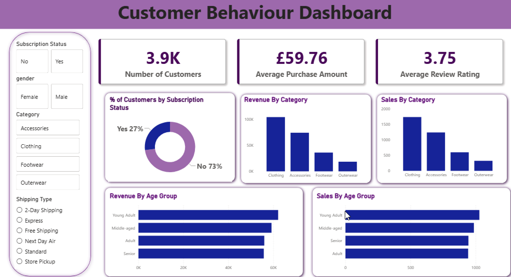

# Customer-Behaviour-Analysis
Analysing purchasing patterns across 3,900 e-commerce customers using Python and SQL, and developing an interactive Power BI dashboard to track key performance indicators and identify retail growth opportunities.
## Power BI Dashboard
Here is a preview of the dashboard built for this analysis

## Objective
The primary goal of this project is to analyse customer purchase behaviour across demographics, product categories, and subscription statuses to identify key growth drivers. 

## Methods 
* **Data Cleaning & Preparation (Python):** Processed raw retail transaction data using Pandas and NumPy to address missing values, structure data types, and clean demographic information.
* **Exploratory Data Analysis (SQL / Python):** Queried transactional data to analyse purchasing frequency, calculate lifetime metrics, and segment customers by age group, category, and review ratings.
* **Data Visualization & Dashboarding (Power BI):** Built an interactive, dynamic Power BI dashboard featuring dynamic filters (Subscription Status, Gender, Shipping Type, Category) and key KPIs to enable drill-down analysis.

## Results

### Key Performance Indicators (KPIs)
* **Total Customers:** 3,900
* **Average Purchase Amount:** £59.76
* **Average Review Rating:** 3.75 / 5.00

### Customer Insights
* **Subscription Engagement:** Only **27%** of customers hold an active subscription, while **73%** are non-subscribers, indicating a significant retention and recurring-revenue growth opportunity.
* **Top Categories:** **Clothing** is the leading revenue driver (~£100k+) and volume generator (~1,750+ units), followed by **Accessories**. **Footwear** and **Outerwear** trail substantially.
* **Demographics:** **Young Adults** generate the highest revenue (~£62k) and unit sales (>1,000 units), with **Middle-aged** consumers representing the second-largest customer segment.

## Tools Used
- Python
- SQLite
- Power BI desktop
